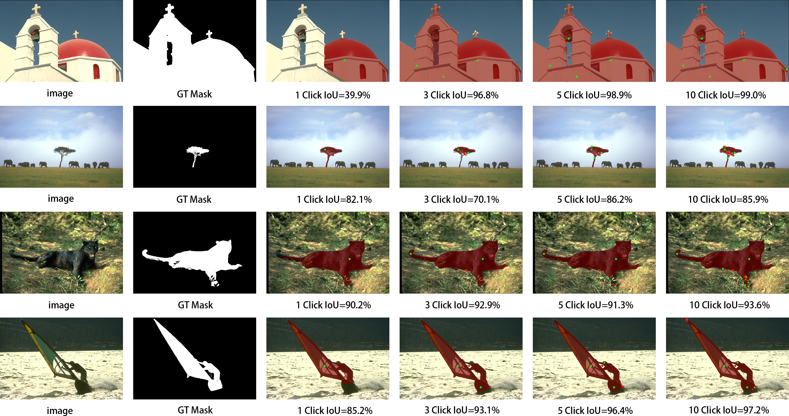
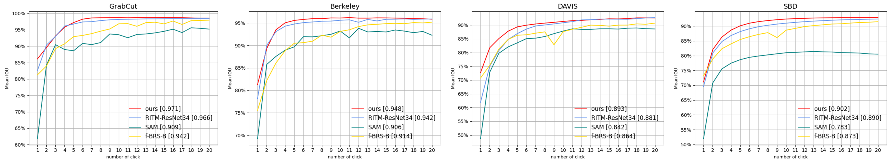

# Multi-branch U-net for Interactive Image Segmentation
## Introduction
This work is a click-based interactive segmentation codebase developed on top of the [RITM codebase][ritmcode].

[ritmcode]:https://github.com/saic-vul/ritm_interactive_segmentation
## Performance
<p align="center">
  
</p>
<p align="center">
  
</p>
<p align="center">
  
</p>

## Training and evaluation models
### training models
```
python train.py models/mymodel/Res34_FTB.py --gpus=0 --workers=4 --exp-name=first-try
python train.py models/mymodel/Res34_CTB.py --gpus=0 --workers=4 --exp-name=first-try
python train.py models/mymodel/Res34_CTB_ALF_LPP.py --gpus=0 --workers=4 --exp-name=first-try
```
### evaluation models
```
python scripts/evaluate_model.py NoBRS --exp-path=mymodel/MutiNet/000:129 --datasets=GrabCut
```

## Testing
### pretrained models
We conducted full ablation experiments on the network.

You can find model weights and evaluation results in the tables below:
<table>
    <thead align="center">
        <tr>
            <th rowspan="2">Model</th>
            <th>GrabCut</th>
            <th>Berkeley</th>    
            <th>DAVIS</th>
        </tr>
        <tr>
            <td>NoC<br>85/90%</td>
            <td>NoC<br>85/90%</td>
            <td>NoC<br>85/90%</td>
        </tr>
    </thead>
    <tbody align="center">
        <tr>
            <td align="center"><a href="https://drive.google.com/file/d/19oXKsQfLcNDt7yuaavsJwD3X2Sl4HlWk/view?usp=sharing">FTB<br></a></td>
            <td>1.62/1.76</td>
            <td>1.85/2.58</td>
            <td>4.78/6.14</td>
        </tr>
    </tbody>
    <tbody align="center">
        <tr>
            <td align="center"><a href="https://drive.google.com/file/d/1HLnzSiKo3Ap23Jh1ngdGRPVBPCY_JrEW/view?usp=sharing">CTB<br></a></td>
            <td>1.58/1.66</td>
            <td>1.68/2.45</td>
            <td>4.68/6.19</td>
        </tr>
    </tbody>
    <tbody align="center">
        <tr>
            <td align="center"><a href="https://drive.google.com/file/d/1j6MhUVHNbawjphFYjk7c5TPYZ6d463tv/view?usp=sharing">CTB+ALF<br></a></td>
            <td>1.56/1.60</td>
            <td>1.61/2.39</td>
            <td>4.66/6.00</td>
        </tr>
    </tbody>
    <tbody align="center">
        <tr>
            <td align="center"><a href="https://drive.google.com/file/d/1vl_uILwbmzMcfYzudo9A_WYCBZpAfP5-/view?usp=sharing">CTB+ALF+LPP<br></a></td>
            <td>1.52/1.58</td>
            <td>1.61/2.33</td>
            <td>4.63/5.94</td>
        </tr>
    </tbody>
</table>
